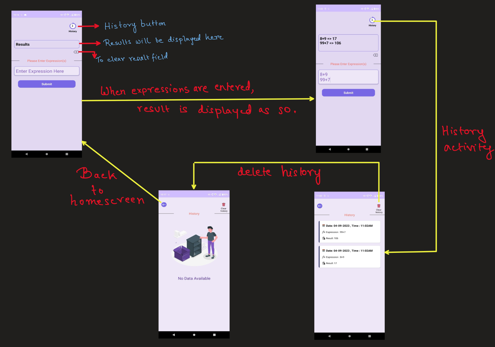

# OnlineSales.ai_Assignment

I am pleased to announce the development of my new mathematical expression calculation app, built entirely in Java. This app offers users a seamless experience for solving mathematical expressions using a free REST API, making complex calculations easier than ever.



**Key Features:**
- **Mathematical Expression Calculation:** The app allows users to input mathematical expressions and swiftly calculates the results using a free REST API, ensuring accurate and quick solutions.

- **Two-Page Interface:** Our app features a user-friendly interface with two distinct pages. The first page is dedicated to performing real-time mathematical calculations, while the second page serves as a comprehensive history log.

- **History Tracking:** Users can conveniently access a complete history of all their past mathematical calculations. This feature is designed to help users keep track of their work and revisit previous calculations.

- **Retrofit Integration:** To communicate with the REST API, I have integrated Retrofit, a powerful library for making HTTP requests. This ensures reliable and efficient data exchange with the API.

- **SQLite Database with ROOM:** For storing and managing calculation history, I have implemented an SQLite database using ROOM, a well-known database library for Android. This choice simplifies data access and ensures a smooth user experience.

- **Intuitive UI:** I have taken great care to create a simple and intuitive user interface. Our aim is to make mathematical calculations accessible to users of all skill levels, ensuring a hassle-free experience.

## Installation and Building

To run the app from the source code, follow these steps:

1. **Clone the Repository**: First, clone this repository to your local machine using Git:

   ```bash
   git clone https://github.com/Jarvis-byte/OnlineSales.ai_Assignment.git
   
1. **Open in Android Studio:** Open the project in Android Studio by selecting the project's root directory.

2. **Sync `build.gradle`:** In Android Studio, open the `build.gradle` file located in the project's root directory and sync it to install all the necessary dependencies. You can do this by clicking the "Sync Now" button that appears in the notification bar or by selecting "File" > "Sync Project with Gradle Files."

3. **Build and Run:** After the synchronization is complete, you can build and run the app on an Android emulator or a physical device using Android Studio.

4. **Explore the App:** Once the app is up and running, you can explore its features as described in the previous sections.

If you encounter any issues during the installation or have questions about the app, feel free to reach out for assistance.

I am excited to share this app with you and hope you find it valuable in your day-to-day mathematical tasks. Your feedback and suggestions are highly appreciated . Thank you for your support, and I look forward to your positive experience with my Java-based mathematical expression calculation app.
